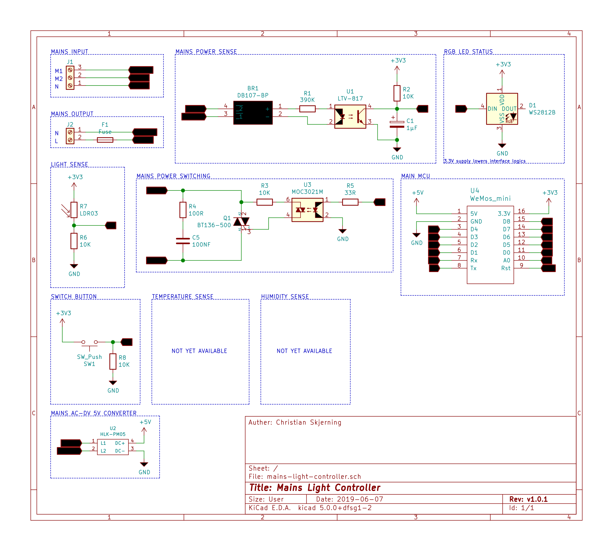

<h1>Mains Light Controller</h1>

This component can control any loads of mains voltage up to 10A.
Requires constant power and sensing line (100-230VAC).

<h2>Circuit Design</h2>

Schematic

PCB layout

<h3>Power inputs</h3>
<ul>
    <li>M1: Power from switches</li>
    <li>M2: Constant power supply</li>
    <li>N: Neutral</li>
</ul>

 

<h3> Parts list </h3>
<table style="text-align:left">
  <tr> <th>#</th> <th>Quantity</th>  <th>Part</th> <th>Section</th> <th>Link</th> </tr>
  <tr> <td>1</td> <td>1</td> <td>WeMos D1 (ESP8266)</td> <td>Controller</td> <td></td> </tr>
  <tr> <td>2</td> <td>1</td> <td>WS1228b RGB LED</td> <td></td> <td></td> </tr>
  <tr> <td>3</td> <td>1</td> <td>LDR</td> <td></td> <td></td> </tr>
  <tr> <td>4</td> <td>1</td> <td>1/4W 10k Ohms resistor</td> <td></td> <td></td> </tr>
  <tr> <td>5</td> <td>1</td> <td>01x02 Screw terminal (5.08mm pin spacing)</td> <td></td> <td></td> </tr>
  <tr> <td>6</td> <td>1</td> <td>01x03 Screw terminal (5.08mm pin spacing)</td> <td></td> <td></td> </tr>
  <tr> <td>7</td> <td>1</td> <td>DB107 Full bridge rectifier</td> <td>Sensing</td> <td></td> </tr>
  <tr> <td>8</td> <td>1</td> <td>LTV-817 Optocoupler</td> <td></td> <td></td> </tr>
  <tr> <td>9</td> <td>1</td> <td>1µf Electrolytic capacitor (min 50V)</td> <td></td> <td></td> </tr>
  <tr> <td>10</td> <td>1</td> <td>1/2W 10k Ohms resistor</td> <td></td> <td></td> </tr>
  <tr> <td>11</td> <td>1</td> <td>HLK-PM05 AC-DC 5V voltage regulator</td> <td></td> <td></td> </tr>
  <tr> <td>12</td> <td>1</td> <td>MOC3021 Optocoupler</td> <td>Load controller</td> <td></td> </tr>
  <tr> <td>13</td> <td>1</td> <td>BT136 Triac (500V)</td> <td></td> <td></td> </tr>
  <tr> <td>14</td> <td>1</td> <td>1/2W 100 Ohms resistor</td> <td></td> <td></td> </tr>
  <tr> <td>15</td> <td>1</td> <td>1/2W 10k Ohms resistor</td> <td></td> <td></td> </tr>
  <tr> <td>16</td> <td>1</td> <td>1/2W 330 Ohms resistor</td> <td></td> <td></td> </tr>
  <tr> <td>17</td> <td>1</td> <td>1/2W 100nf Ceramic capacitor</td> <td></td> <td></td> </tr>
</table>

